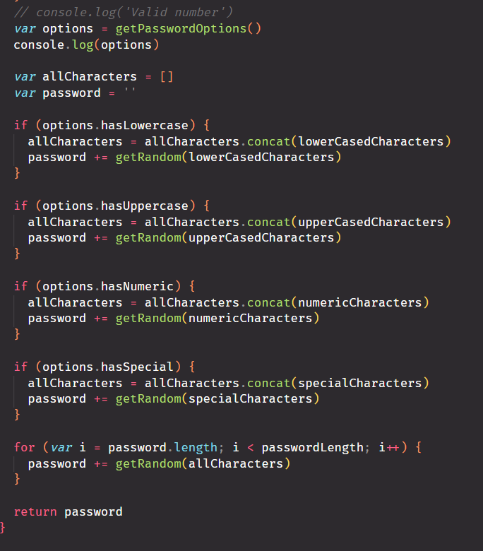
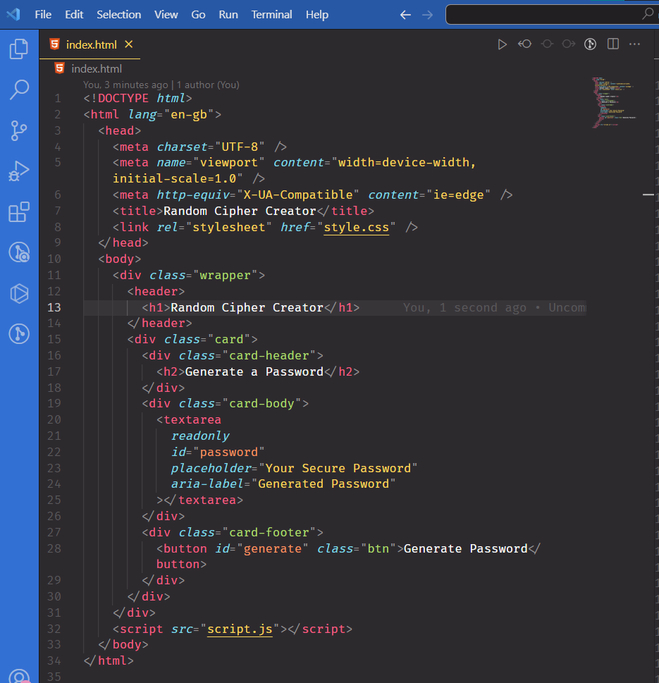
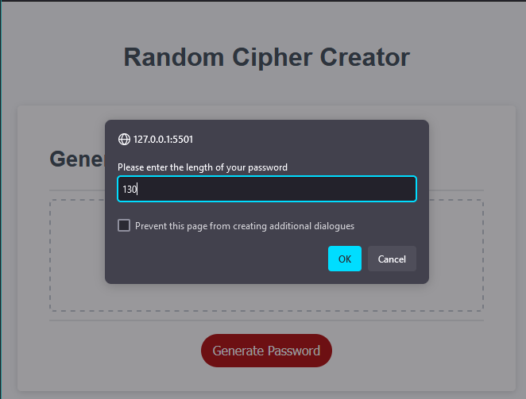

# random-cipher-creator

## Description

This JavaScript code helps you understand how passwords are generated. You can customise the passwords by choosing the length and types of characters. The code uses arrays to store different sets of characters like lowercase, uppercase, numbers, and special characters, making the passwords diverse. It checks and validates user inputs to ensure a valid numeric password length within a specified range. The script randomly selects elements from arrays, adding a layer of security to the generated passwords. The "Generate" button triggers the password generation function, and user prompts allow customisation based on preferences. The code is well-organised, emphasising secure password practices for creating strong passwords. It integrates with HTML elements, enhancing user interaction for password generation and display.

## Table of Contents (Optional)

If your README is long, add a table of contents to make it easy for users to find what they need.

-   [Installation](#installation)
-   [Usage](#usage)
-   [Credits](#credits)
-   [License](#license)

## Installation

N/A

## Usage

You can view the website via this link: [add url after deployment]

-   
-   
-   

-   
-   
-   
-   
-   
-   
-   
-   
-   
-   
-   
-   
-   
-   
-   
-   
-   
-   
-   

## Credits

-   Insightful tutoring session with David, Elutilo
-   Sharing our understanding of the topic with colleagues in breakout room sessions

### List of third-party assets.

-   Class activity: 05-advanced-javascript-module/04-password-generator-lesson/challenge
-   Stackoverflow: https://stackoverflow.com/questions/59504465/generate-random-password-based-on-user-input-in-javascript
-   Code with Bash: https://forum.codewithmosh.com/t/creating-a-password-generator-using-javascript/18971

## License

Please refer to the repo.

---
